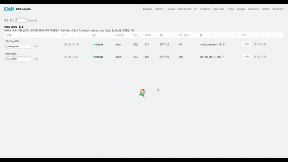
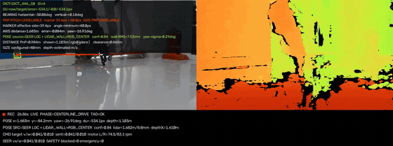
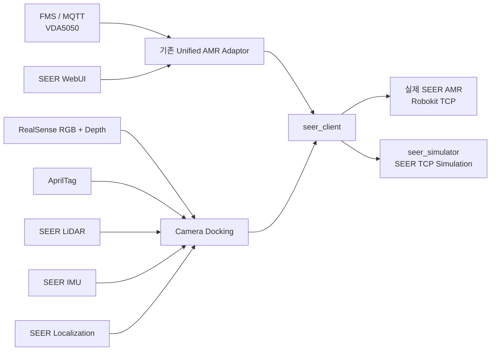

# SEER AMR Client & Simulator

기존 **Unified AMR Adaptor** 환경에 SEER AMR을 연결하기 위한 `seer_client`와, 실제 장비 없이 동일한 통신 흐름을 검증하기 위한 `seer_simulator`입니다.

이 README는 **직접 개발한 SEER 관련 영역만** 설명합니다. 저장소의 다른 폴더는 기존 프로젝트 구성요소 또는 통합 의존성이며, 이 문서에서는 해당 구현을 개발 범위로 주장하지 않습니다.

---

## Demo

README에서는 큰 원본 MP4 대신 **가벼운 움직이는 GIF 미리보기**가 바로 재생됩니다. 아래 미리보기는 별도 다운로드 없이 바로 확인할 수 있고, 전체 영상은 저용량 MP4 링크로 열 수 있습니다.

### SEER AMR 통합 테스트



**[▶ 전체 영상 바로 재생 · 저용량 MP4 약 4 MB](docs/media/seer_amr_test_web.mp4?raw=1)**  
WebUI에서 실물 SEER AMR의 지도, 상태, 제어, VDA5050/Action, Block Builder 흐름 등을 확인하는 테스트 영상입니다. 전체 길이는 약 6분 18초입니다.

### Camera Docking 성공 테스트



**[▶ 전체 영상 바로 재생 · 저용량 MP4 약 1.4 MB](docs/media/seer_docking_success_web.mp4?raw=1)**  
RealSense RGB/Depth, AprilTag, LiDAR, IMU, SEER localization을 이용한 카메라 도킹 테스트 영상입니다. 전체 길이는 약 35초입니다.

> README의 GIF는 빠르게 동작을 확인하기 위한 미리보기입니다. 전체 영상 링크에는 브라우저에서 바로 스트리밍하기 쉽도록 H.264 MP4와 `faststart`를 적용한 저용량 파일을 사용합니다. ZIP에는 전체 길이를 유지한 저용량 재생용 MP4와 README용 GIF 미리보기만 포함해 저장소 용량을 줄였습니다.

---

## 개발 범위

이 저장소에서 이 README가 설명하는 개발 범위는 다음 두 폴더입니다.

```text
seer_client/       # 실제 SEER AMR 통신, Adapter 연동, WebUI, VDA5050, Camera Docking
seer_simulator/    # 실제 장비 없이 SEER TCP/API 흐름을 검증하는 시뮬레이터
```

그 외 폴더는 기존 Unified AMR Adaptor 프로젝트의 구성요소이며, `seer_client`가 런타임에서 연동하기 위해 사용합니다.

### 설계 방향

- 기존 공용 Adapter 코드를 가능한 한 그대로 사용
- SEER 전용 동작은 `seer_client` 내부에 격리
- 실제 SEER와 Simulator가 가능한 한 같은 상위 제어 흐름을 사용
- FMS/WebUI 입력은 VDA5050 `order` / `instantActions` 형식을 유지
- 실물 테스트 전에 동일한 WebUI와 Adapter 흐름을 Simulator로 먼저 검증

---

## 전체 구조



### SEER 기본 TCP 포트

| 포트 | 용도 |
|---:|---|
| `19204` | STATE |
| `19205` | CONTROL |
| `19206` | TASK |
| `19207` | CONFIG |
| `19210` | OTHER |

포트는 장비 설정에 따라 명령행 옵션으로 변경할 수 있습니다.

---

# 1. `seer_client`

`seer_client`는 실제 SEER Robokit API와 기존 Adapter 사이의 연결 계층입니다. 단순 API 호출기뿐 아니라 WebUI, VDA5050 변환, 상태 수집, 지도, IO, Recipe, Block Builder, Camera Docking까지 포함합니다.

## 주요 기능

| 기능 | 설명 |
|---|---|
| SEER TCP 통신 | STATE / CONTROL / TASK / CONFIG / OTHER 포트 처리 |
| 상태 모니터링 | 위치, heading, 배터리, blocked, emergency, motor, localization 등 |
| 지도 | API 4011 `.smap`을 이용한 WebUI 지도 표시 |
| Navigation | 좌표 이동, Path Nav, 지정 경로 실행 |
| 수동 조작 | `vx`, `w` 기반 실시간 수동 주행과 dead-man 안전 처리 |
| IO | DI 조회, DO ON/OFF |
| 작업 제어 | Pause / Resume / Cancel / Emergency |
| VDA5050 | `order`, `instantActions`, `state`, `connection` MQTT 처리 |
| Multi AMR | 한 WebUI에서 여러 실제/가상 SEER 관리 |
| Actions / Recipes | HCL 기반 SEER Action/Recipe 구성 |
| Block Builder | WebUI에서 블록식 Recipe 생성 및 실행 |
| Camera Docking | RealSense + AprilTag + LiDAR + IMU + SEER localization 기반 도킹 |
| 기록 | Adapter 로그, VDA5050 trace, Camera Docking telemetry/video 기록 |

---

## 설치

### 기본 SEER Client

저장소 최상위 폴더에서 실행합니다.

#### Windows PowerShell

```powershell
python -m pip install -r .\adaptor\requirements.txt
python -m pip install -e .\amr-client-contract -e .\seer_client
```

#### Linux

```bash
python3 -m pip install -r ./adaptor/requirements.txt
python3 -m pip install -e ./amr-client-contract -e ./seer_client
```

### Camera Docking까지 사용할 경우

Camera Docking은 OpenCV, NumPy, RealSense Python 패키지를 추가로 사용합니다.

```powershell
python -m pip install -e ".\seer_client[docking]"
```

`pyrealsense2`가 카메라를 열 수 있도록 Intel RealSense 드라이버/SDK와 USB 연결 상태도 확인해야 합니다.

---

# 2. 가장 빠른 테스트: Simulator

실물 AMR에 연결하기 전에 Simulator부터 검증하는 것을 권장합니다.

## 2.1 WebUI + Simulator

```powershell
python .\seer_client\run_webui.py `
  --simulator `
  --id SEER-SIM-001 `
  --x 1000 --y 2000 --theta 90 --battery 70
```

브라우저에서 다음 주소를 엽니다.

```text
http://127.0.0.1:9010/
```

WebUI 로그인 정보는 `seer_client/webui_credentials.toml`에서 설정합니다.

### Simulator에서 먼저 확인할 항목

1. Adapter 상태가 ONLINE인지 확인
2. 지도에 AMR이 표시되는지 확인
3. 수동조작 활성화 후 저속 전/후진 및 회전 확인
4. IO에서 DO 상태 변경 확인
5. Emergency 설정/해제 확인
6. 지도에서 Path Nav 실행
7. Pause → Resume → Cancel 흐름 확인
8. Actions 실행
9. Block Builder에서 간단한 Recipe 생성 후 실행
10. VDA5050 화면에서 MQTT JSON 흐름 확인

---

## 2.2 터미널에서 Simulator 직접 시험

```powershell
python .\seer_client\manual_test.py `
  --simulator `
  --x 1000 --y 2000 --theta 90 --battery 70
```

예시:

```text
status
io
do 3 on
io
goto_xyz 1500 250 45
watch 10 0.1
stop
quit
```

---

## 2.3 Adapter만 Simulator와 실행

```powershell
python .\seer_client\run_adapter.py `
  --simulator `
  --id SEER-SIM-001 `
  --x 1000 --y 2000 --theta 90 --battery 70 `
  --vehicle-smoke-test
```

---

# 3. 실제 SEER AMR 연결

## 3.1 네트워크 확인

먼저 PC에서 SEER STATE 포트가 열리는지 확인합니다.

```powershell
Test-NetConnection 192.168.43.103 -Port 19204
```

정상이라면 `TcpTestSucceeded : True`가 표시됩니다.

장비 IP가 다르면 실제 AMR IP로 변경합니다.

---

## 3.2 조회 전용 콘솔

이동 명령 전에 상태부터 확인합니다.

```powershell
python .\seer_client\manual_test.py --ip 192.168.43.103
```

먼저 아래 항목을 확인합니다.

```text
status
emergency
io
map
```

---

## 3.3 실제 AMR + WebUI

```powershell
python .\seer_client\run_webui.py `
  --id SEER-IP-192-168-43-103 `
  --vehicle-ip 192.168.43.103 `
  --mqtt-host 127.0.0.1 `
  --mqtt-port 1883
```

기본 WebUI:

```text
http://127.0.0.1:9010/
```

### 정상 연결 확인

WebUI에서 최소한 다음 상태가 확인되어야 합니다.

- SEER connection: `ONLINE`
- 실시간 x / y / yaw 값 갱신
- 현재 map 표시
- blocked / emergency 상태 표시
- IO 상태 조회
- MQTT를 사용하는 경우 `FMS MQTT = CONNECTED`

> `SEER ONLINE`과 `FMS MQTT CONNECTED`는 서로 다른 연결입니다. MQTT가 끊겨도 SEER TCP와 로컬 WebUI 제어는 별도로 동작할 수 있습니다.

---

## 3.4 Adapter만 실행

WebUI 없이 Adapter만 사용할 수 있습니다.

```powershell
python .\seer_client\run_adapter.py `
  --id SEER-IP-192-168-43-103 `
  --vehicle-ip 192.168.43.103 `
  --mqtt-host 127.0.0.1 `
  --mqtt-port 1883
```

기본 포트가 아닌 경우 다음 옵션을 추가합니다.

```text
--seer-state-port 19204
--seer-control-port 19205
--seer-task-port 19206
--seer-config-port 19207
--seer-other-port 19210
```

---

# 4. VDA5050 테스트

기본 MQTT topic prefix는 다음 구조를 사용합니다.

```text
amr/v3/<AMR-ID>/order
amr/v3/<AMR-ID>/instantActions
amr/v3/<AMR-ID>/state
amr/v3/<AMR-ID>/connection
```

예:

```text
amr/v3/SEER-IP-192-168-43-103/order
```

## MQTT 왕복 테스트

Adapter와 같은 AMR ID 및 MQTT broker를 사용합니다.

```powershell
python .\seer_client\manual_test.py `
  --vda5050 `
  --id SEER-IP-192-168-43-103 `
  --mqtt-host 127.0.0.1 `
  --mqtt-port 1883 `
  --allow-write
```

### 확인할 흐름

```text
FMS / WebUI
   ↓
VDA5050 order 또는 instantActions
   ↓
MQTT broker
   ↓
Adapter
   ↓
seer_client
   ↓
SEER TCP API
   ↓
SEER state
   ↓
VDA5050 state / connection
```

Path Nav는 `/order`, Pause/Resume/E-stop/DO 등 즉시 명령은 주로 `/instantActions` 흐름으로 확인합니다.

자세한 JSON 테스트는 [seer_client/VDA5050_TEST.md](seer_client/VDA5050_TEST.md)를 참고합니다.

---

# 5. WebUI 기능 테스트

## Map / Path Nav

- 현재 SEER map을 API 4011에서 가져와 표시
- AMR 위치와 방향 표시
- map point 선택
- 가능한 경로 후보 계산
- 선택 경로를 VDA5050 `/order`로 전달
- 실행 중 경로 표시
- Pause / Resume / Cancel 확인

## Manual Drive

수동조작을 사용하려면 WebUI에서 **수동조작 활성화**를 먼저 켭니다.

현재 기본값:

```text
linear velocity  : 0.05 m/s
angular velocity : 5 deg/s
```

브라우저 포커스를 잃거나 장시간 입력이 없으면 수동조작 활성화가 자동 해제되도록 구성되어 있습니다.

## IO

- DI: 상태 조회
- DO: ON/OFF 제어
- 실물에서는 API 1013이 반환한 채널 범위를 사용
- Simulator 기본값은 DI0~DI23, DO0~DO15

## Actions / Recipe / Block Builder

지원 예:

- Coordinate Navigation
- Translate
- Turn
- Path Nav
- Set DO
- Wait
- 반복 / 조건 / 변수 / 함수 기반 Block Program

Recipe는 AMR별 runtime 설정과 함께 관리할 수 있으며, Block Builder에서 작성한 실행 흐름도 WebUI Actions에서 호출할 수 있습니다.

---

# 6. Camera Docking

Camera Docking은 SEER 기본 Navigation과 별도로, 정밀 접근을 시험하기 위해 추가한 기능입니다.

## 현재 도킹 설정 기준

| 항목 | 현재 설정 |
|---|---|
| Camera | Intel RealSense 계열 RGB + Depth |
| RGB profile | 1280 × 720 @ 30 FPS |
| AprilTag dictionary | `DICT_4X4_50` |
| Tag ID | `4` |
| Tag size | `0.04 m` (40 × 40 mm) |
| Camera mount X | 회전중심 기준 전방 `+0.375 m` |
| Camera mount Y | 약 `0 m` |
| Camera mount Z | `0.62 m` |
| 최종 tag depth | 약 `0.50 m` |
| 최종 허용 범위 | ± `0.03 m` |
| Centerline 목표 | 회전중심 기준 ± `2 mm` |
| Yaw test speed | `1 deg/s` |
| LIVE 최대시간 기본값 | `300 s` |

설정 파일:

```text
seer_client/config/docking.json
```

---

## 센서 사용 구조

```text
RealSense RGB
   └─ AprilTag ID/중심/방향

RealSense Depth
   └─ Tag depth / 전방 clearance

SEER LiDAR
   └─ 벽면 geometry / wall normal

SEER IMU
   └─ 상대 yaw 변화 / yaw-rate 보조

SEER Localization
   └─ map 기준 x / y / yaw 절대 위치

        ↓ Fusion

Dock relative pose
        ↓
Centerline / Yaw / Straight controller
        ↓
SEER CONTROL API 2010
```

### WORLD AXIS LOCK

현재 버전은 AMR을 정지시킨 상태에서 **LiDAR wall + RGB Tag center의 7개 안정 샘플**을 이용해 태그 중심 법선축을 SEER map 좌표계에 고정합니다.

축이 LOCK된 뒤에는 카메라/LiDAR의 프레임별 노이즈가 목표 중심축 자체를 계속 이동시키지 않도록 하고, SEER x/y와 상대 IMU yaw를 이용해 고정 축에 대한 AMR pose를 추적합니다.

---

## Camera Docking 테스트 권장 순서

### 1단계: Preview

WebUI 상단의 **Camera → Camera Docking**에서 먼저 Preview를 실행합니다.

Preview는:

- 카메라 프레임 획득
- AprilTag 검출
- RGB/Depth 계산
- LiDAR wall 정보
- IMU
- SEER localization
- WORLD AXIS 계산
- 예상 `v / w`

까지 계산하지만 **AMR에는 이동 명령을 보내지 않습니다.**

먼저 Preview에서 다음 값이 정상적으로 들어오는지 확인합니다.

```text
TAG TRACKER       TRACKING / CTRL OK
SEER LOCALIZATION x / y / yaw
LIDAR STREAM      pts > 0
IMU ATTITUDE      yaw / roll / pitch
TAG DEPTH         유효값
WORLD AXIS        LOCKED
```

---

### 2단계: 단계별 1회 테스트

전체 자동 도킹 전에 세 단계를 각각 분리해서 확인할 수 있습니다.

#### ① 회전중심 맞추기

```text
LiDAR wall + RGB tag center
        ↓
WORLD AXIS LOCK
        ↓
AMR rotation center를 중심축 ±2 mm 안으로 정렬
        ↓
정지
```

- 이 단계에서는 Yaw 정렬까지 자동으로 이어가지 않음
- 자동 후퇴/재접근 복구 없음

#### ② 각도 맞추기 · 1°/s

- ①에서 저장한 WORLD AXIS를 재사용
- 중심축을 카메라 값으로 다시 만들지 않음
- 현재 위치에서 Yaw만 정렬
- 회전 속도 최대 `1 deg/s`
- 완료 후 정지

#### ③ 그대로 직진 · IMU/SEER Heading Hold

- 카메라 steering OFF
- 저장된 WORLD AXIS 사용
- SEER map heading + 상대 IMU yaw 기반 heading hold
- 완전한 `w=0` 고정 대신 차체가 틀어질 때 작은 `w`만 보정
- 현재 설정의 보정 제한: 약 ±`0.35 deg/s`
- 직진 속도: 약 `0.025 m/s`
- `tag_depth ≈ 0.50 m`에서 정지

단계별 테스트는 로봇이 후퇴해서 다시 접근하는 자동 recovery를 수행하지 않도록 별도로 구성되어 있습니다.

---

### 3단계: Full LIVE Docking

단계별 동작이 정상임을 확인한 뒤 **도킹 시작 · Action**을 실행합니다.

현재 자동 도킹의 큰 흐름은 다음과 같습니다.

```text
Sensor / Tag acquisition
        ↓
WORLD AXIS LOCK
        ↓
CENTERLINE
        ↓
YAW ALIGN
        ↓
STRAIGHT APPROACH
        ↓
약 0.50 m 도달
        ↓
FINAL HOLD
        ↓
DOCKED
```

최종 성공은 현재 설정에서 `tag_depth = 0.50 ± 0.03 m` 부근에서 정렬 상태를 약 3초 유지했을 때 판정합니다.

---

## Camera Docking 화면에서 확인할 값

문제가 생기면 영상만 보지 말고 아래 값을 함께 확인합니다.

```text
WORLD AXIS / AXIS samples
Axis distance
Axis error
Yaw error
DU
Pose source / Pose quality
SEER localization
Straight Target / Current heading
Heading error
Straight cross-track
LiDAR wall / point count / age
IMU yaw / yaw-rate
Tag depth / clearance
Target v / w
Sent v / w
SEER vx / w
Blocked / Emergency
CONTROL latency / reconnect / error
```

특히 실제 직진 여부는 카메라만으로 판단하지 않고 **SEER x/y/yaw + IMU yaw 변화 + cross-track**을 같이 보는 것이 중요합니다.

---

## Camera Docking 기록

LIVE Docking에서는 설정에 따라 다음 자료를 자동 저장합니다.

- RGB + Depth 합성 영상
- 명령 `v / w`
- SEER 실제 `vx / w`
- motor RPM
- Camera/Tag pose
- LiDAR / IMU / localization 관련 telemetry
- 세션 JSON/CSV

현재 recording 설정은 `MJPG AVI + CSV`이며, 도킹 제어 루프와 녹화 작업을 분리해 기록 때문에 제어 주기가 과도하게 느려지지 않도록 구성되어 있습니다.

---

## Camera Docking 주의사항

- 실제 이동 시험 전 Emergency Stop과 주변 안전공간을 확보합니다.
- SEER의 blocked / emergency / motor 상태는 안전 정지 조건으로 사용합니다.
- Camera Docking은 장비의 물리 안전기능을 우회하지 않습니다.
- Wi-Fi가 불안한 환경을 고려해 단계 테스트의 CONTROL ACK 순간 지연은 일부 허용하지만, STATE stale / blocked / emergency는 fail-closed로 처리합니다.
- 현재 WORLD AXIS는 **정지 상태의 7개 LiDAR+RGB 샘플 안정성**을 기준으로 잠급니다.
- 멀리 있는 작은 Tag를 최초 인식한 뒤 더 가까운 거리에서 별도의 2차 검증을 거쳐 재-lock하는 로직은 이 버전의 별도 단계로 구현되어 있지 않습니다. 따라서 실물 시험에서는 Full LIVE 전에 Preview와 ① 단계 테스트로 WORLD AXIS 품질을 확인하는 것을 권장합니다.

---

# 7. `seer_simulator`

`seer_simulator`는 단순히 Python 메서드 반환값만 흉내 내는 mock이 아닙니다.

실제 `SeerClient`가 로컬 TCP 서버에 접속하여 SEER 패킷을 주고받도록 구성되어 있어 다음 계층까지 함께 시험할 수 있습니다.

```text
Adapter
  ↓
seer_client
  ↓
TCP request frame
  ↓
seer_simulator
  ↓
TCP response frame
  ↓
seer_client parser
  ↓
Adapter / WebUI / VDA5050 state
```

## Simulator에서 검증 가능한 주요 기능

- SEER 5개 TCP 포트 연결
- 위치 / yaw / battery 상태
- 수동 이동
- Navigation 상태 전이
- API 4011 map
- DI / DO
- Software Emergency
- Pause / Resume
- Path Nav
- VDA5050 order/instantActions 흐름
- 여러 Simulator를 동시에 띄운 Multi AMR WebUI

## Simulator의 한계

Simulator는 다음 실제 물리 현상을 그대로 재현하지 않습니다.

- 실제 바퀴 마찰 및 슬립
- 실제 가감속 프로파일
- LiDAR 실측 노이즈
- 카메라 노이즈
- 충돌 회피 성능
- 안전 PLC
- 실제 motor/driver fault
- 현장 IO 배선
- 실제 SEER localization drift

따라서 **통신/상태/제어 흐름은 Simulator로 먼저 검증하고, 주행 정밀도와 안전 관련 최종 검증은 반드시 실물에서 수행**해야 합니다.

자세한 내용은 [seer_simulator/README.md](seer_simulator/README.md)를 참고합니다.

---

# 8. 권장 전체 테스트 순서

새 버전을 적용했을 때는 아래 순서로 범위를 넓혀 가는 것이 가장 안전합니다.

```text
1. Python unit test
        ↓
2. seer_simulator direct test
        ↓
3. Simulator + Adapter
        ↓
4. Simulator + WebUI
        ↓
5. Simulator + MQTT / VDA5050
        ↓
6. 실제 SEER read-only 상태 조회
        ↓
7. 실제 SEER WebUI map / IO 확인
        ↓
8. 저속 수동조작
        ↓
9. Path Nav / Pause / Resume / Cancel
        ↓
10. Actions / Block Builder / Recipe
        ↓
11. Camera Docking Preview
        ↓
12. Camera Docking ① → ② → ③ 단계 테스트
        ↓
13. Full Camera Docking LIVE
```

---

# 9. 자동 테스트

## SEER Client

```powershell
python -m pytest .\seer_client\tests -q
```

## SEER Simulator

```powershell
python -m pytest .\seer_simulator\tests -q
```

## 둘 다

```powershell
python -m pytest .\seer_client\tests .\seer_simulator\tests -q
```

Camera Docking 관련 테스트에는 다음 영역이 포함됩니다.

- Camera integration
- LiDAR acquisition/fusion
- IMU fusion
- RGB-D pose
- docking phase/final hold
- manual docking stage
- CONTROL/Wi-Fi timeout handling
- WebUI integration

---

# 10. Runtime / Log 위치

SEER 실행 중 생성되는 주요 파일은 `seer_client/runtime/` 아래에서 관리합니다.

단일 AMR 또는 공용 runtime 예:

```text
seer_client/runtime/
├─ config.toml
├─ extensions.hcl
├─ recipes.hcl
├─ seer-adapter.log
├─ seer-controller-status.json
├─ seer-io.json
├─ seer-map.json
└─ vda5050-trace.jsonl
```

다중 AMR에서는:

```text
seer_client/runtime/<AMR-ID>/
```

형태로 로봇별 상태와 로그를 분리합니다.

문제 분석 시 최소한 다음 자료를 함께 확인하는 것이 좋습니다.

```text
seer-adapter.log
vda5050-trace.jsonl
Camera Docking session.json
Camera Docking telemetry.csv
Camera Docking recording.avi
```

---

# 11. 자주 확인하는 문제

| 증상 | 먼저 확인할 것 |
|---|---|
| SEER OFFLINE | AMR IP, `19204` 연결, PC NIC 대역 |
| MQTT OFFLINE | Mosquitto 실행 여부, `1883`, broker IP |
| 지도 안 나옴 | CONFIG `19207`, API 4011, 현재 map |
| Path Nav 무반응 | MQTT `/order`, Adapter 로그, current point/path |
| Pause 후 복귀 안 됨 | Cancel이 아닌 `startPause` / `stopPause` 흐름인지 확인 |
| IO 안 나옴 | STATE API 1013 응답, 장비별 IO 범위 |
| Camera 안 열림 | RealSense USB/SDK, 다른 Preview 프로세스가 카메라 점유 중인지 확인 |
| Docking 바로 FAIL | Tag/Depth/LiDAR/IMU/SEER localization 준비 상태 확인 |
| CONTROL ACK timeout | Wi-Fi 품질, CONTROL latency, 실제 SEER `vx/w` 갱신 확인 |
| Axis 값이 회전 중 튐 | WORLD AXIS LOCK 여부와 `Pose source` 확인 |
| 직진이 휨 | Target/Current heading, IMU yaw-rate, cross-track, 실제 `SEER w` 확인 |

---

# 12. 추가 문서

- [SEER Client 상세 README](seer_client/README.md)
- [SEER 전체 테스트 가이드](seer_client/TEST_GUIDE.md)
- [VDA5050 MQTT 테스트](seer_client/VDA5050_TEST.md)
- [SEER Simulator README](seer_simulator/README.md)
- [VDA5050 샘플 JSON](seer_client/vda5050_samples/README.md)
- [Camera Docking 설정](seer_client/config/docking.json)

---

## 안전

실제 SEER AMR 이동, IO, Motor, Camera Docking 테스트는 반드시 현장 안전조건을 확인한 뒤 수행합니다.

- 비상정지 접근 가능 상태 유지
- 사람/장애물 없는 시험 구역 확보
- 저속부터 검증
- 실제 장비의 blocked / emergency 상태를 우회하지 않기
- Simulator 통과를 실물 안전 검증으로 간주하지 않기

이 프로젝트의 Simulator와 WebUI는 개발 및 통합 검증을 돕는 도구이며, 실제 장비의 안전 PLC나 제조사 안전기능을 대체하지 않습니다.
