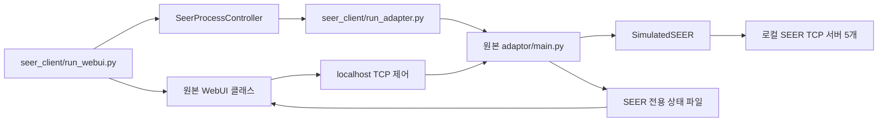
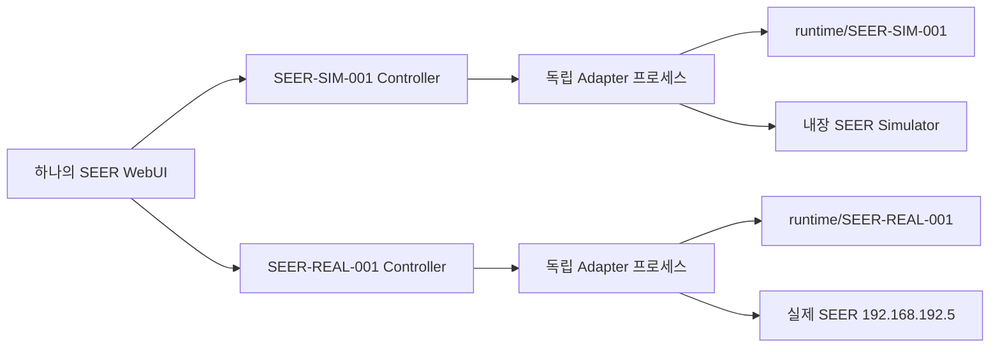
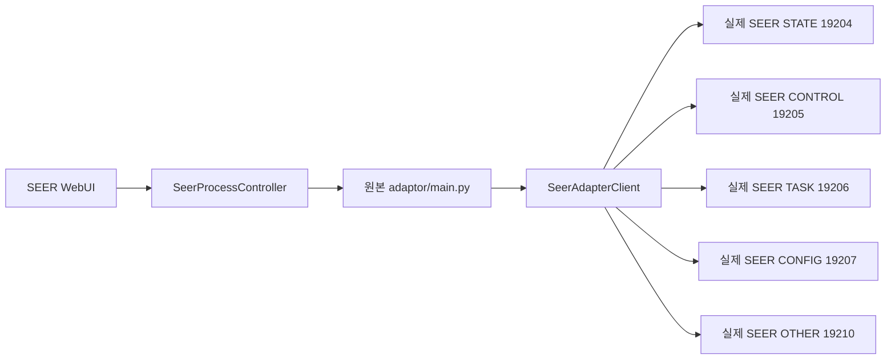

# SEER Client — 원본 무수정 drop-in 구성

> VDA5050 `order`, `instantActions`, `state`, `connection`의 실제 MQTT/웹
> 검증과 Jibot `TestingOrderJson` 방식은
> [VDA5050_TEST.md](VDA5050_TEST.md)를 참고한다.

이 버전은 기존 저장소의 파일을 수정하지 않는다. 저장소 루트에 아래 두 폴더만
복사하여 사용한다.

```text
unified-amr-adaptor/
├─ adaptor/                 원본 그대로
├─ jibot-client/            원본 그대로
├─ jibot-simulator/         원본 그대로
├─ seer_client/             추가 폴더
└─ seer_simulator/          추가 폴더
```

실제 Python import 패키지 이름은 하이픈이 없는 `seer_client`지만, 저장소 폴더
이름은 `seer_client`다.

## 실행 프로그램

| 파일 | 역할 | 원본 수정 |
|---|---|---:|
| `manual_test.py` | SEER API 직접 시험 또는 MQTT VDA5050 왕복 시험 | 없음 |
| `run_adapter.py` | 원본 `adaptor/main.py`에 SEER Client를 메모리에서 주입 | 없음 |
| `run_webui.py` | 원본 WebUI 클래스를 SEER용으로 조립하고 단일/다중 Adapter 프로세스 관리 | 없음 |
| `webui_credentials.toml` | WebUI 사용자명과 비밀번호를 한 번 설정하는 로컬 파일 | 없음 |
| `seer-fleet.toml.example` | 하나의 WebUI에서 관리할 여러 SEER AMR 설정 예제 | 없음 |
| `config/extensions.hcl` | WebUI Actions에 노출할 SEER TCP/IP Action 템플릿 | 없음 |
| `config/recipes.hcl` | 기본 SEER Recipe 템플릿 | 없음 |
| `print_log.py` | WebUI 로그 화면용 SEER 로그 출력 | 없음 |

## 설치

저장소 루트에서:

```powershell
python -m pip install -r .\adaptor\requirements.txt
python -m pip install -e .\amr-client-contract -e .\seer_client
```

`seer_client` 설치 시 `prompt-toolkit`도 함께 설치되어 `manual_test.py`의 Tab
자동완성과 명령 기록을 제공한다.

VS Code/Pylance에서 `amr_client_contract`가 보이지 않으면 위 명령을 실행한 Python
인터프리터를 VS Code에서도 선택한다. `adapter_jibot`은 설치 패키지가 아니라
`run_adapter.py`가 원본 `adaptor/`에서 런타임 로드하는 모듈이다. 두 import에는 이
구조를 정적 분석기가 오해하지 않도록 SEER 코드 안에 범위가 제한된 처리가 들어 있다.

Error Lens는 Pylance 진단을 그대로 표시한다. 전체 저장소를 작업 폴더로 열어 하위
`pyrightconfig.json`이 선택되지 않는 경우에도, 런타임에서만 경로를 추가하는 import에는
줄 단위 `reportMissingImports` 예외가 적용되어 있다. 새 파일로 교체한 뒤 이전 진단이
남아 있으면 VS Code 명령 팔레트에서 `Python: Restart Language Server`를 실행하거나
`Developer: Reload Window`를 실행한다.

## 1. Client 단독 시뮬레이션

```powershell
python .\seer_client\manual_test.py `
  --simulator --x 1000 --y 2000 --theta 90 --battery 70
```

예시 명령:

```text
status
emergency
io
do 3 on
io
goto_xyz 1500 250 45
watch 10 0.1
stop
quit
```

`seer>`와 `vda5050>` 프롬프트에서 Tab 한 번은 공통 접두사를 자동완성하고, 같은
위치에서 Tab을 한 번 더 누르면 관련 명령·파라미터 후보를 표로 보여준다. `last`
토픽, `do`/`motor`의 on/off, JSON 파일 경로도 현재 입력 위치에 맞춰 완성한다.

소프트웨어 비상정지는 시뮬레이터 또는 `--allow-write`를 지정한 실물 세션에서
`emc`(설정), `emc_release`(해제)로 명시적으로 제어할 수 있다. 기존
`soft_emergency on/off`, `toggle_emergency`도 호환성을 위해 유지한다.

### VDA5050 MQTT 왕복 시험

실행 중인 Adapter와 같은 AMR ID/MQTT broker를 지정한다. 이 모드는 Jibot
`TestingOrderJson`처럼 실제 `order`/`instantActions`를 발행하고
`state`/`connection` 원문을 다시 구독한다.

```powershell
python .\seer_client\manual_test.py `
  --vda5050 --id SEER-SIM-001 `
  --mqtt-host 127.0.0.1 --mqtt-port 1883 `
  --allow-write
```

수신 출력은 기본 quiet 모드다. 주기 `state`는 내부에만 저장되며 `status`는 다음
state 한 건, `last state`는 최신 저장값 한 번, `watch 5`는 5초 동안만 실시간
수신을 출력한다. 따라서 Adapter와 함께 켜도 터미널이 state로 계속 채워지지 않는다.
VDA5050 모드에서도 `emc`는 status=on, `emc_release`는 status=off인
`seerEmergencySwitch` instantAction을 발행한다.

`goto LM1`, `goto_route CP12 LM11 LM1`, WebUI 지도 Path Nav는 모두 실제 FMS와
같은 MQTT `/order`의 `nodes[] + edges[]` 형식으로 발행한다. node/edge Action은 각
`actions[]`에 그대로 넣을 수 있다. Pause/Resume/E-stop/DO/Motor/좌표 이동 같은 즉시
명령은 MQTT `/instantActions`의 `actions[]` 형식으로 발행한다. Adapter 아래에서 어떤
SEER API로 변환되는지는 southbound 구현 세부사항이고, FMS/WebUI/manual_test의 입력
형식은 실물과 Simulator에서 동일하다.

상단 WebUI의 `VDA5050` 메뉴에서도 네 토픽의 횟수·방향·전체 JSON과 WebUI의
`WEBUI MQTT TX`를 볼 수 있다. 자세한 내용은 `VDA5050_TEST.md`를 참고한다.

## 2. 원본 Adapter + SEER 시뮬레이터

```powershell
python .\seer_client\run_adapter.py `
  --simulator --id SEER-SIM-001 `
  --x 1000 --y 2000 --theta 90 --battery 70 `
  --vehicle-smoke-test
```

`run_adapter.py`는 원본 `adaptor/main.py`를 파일 변경 없이 로드한다. 실행 메모리에서
JIBOT 생성 지점만 `SeerAdapterClient` 또는 `SimulatedSEER`로 바꾼다.

## 3. 원본 WebUI + SEER 시뮬레이터

먼저 `seer_client/webui_credentials.toml`을 한 번만 열어 사용자명과 12자 이상의
비밀번호를 입력한다.

```toml
[webui]
username = "seer"
password = "현장에서-정한-12자이상-비밀번호"
```

이 파일은 평문 비밀번호를 포함하므로 외부에 공유하거나 비밀번호를 입력한 상태로 다시
압축하지 않는다. 다른 경로를 사용하려면 `--credentials-file 경로`를 지정한다. 우선순위는
명령행 `--username/--password` → 자격증명 파일 → 환경변수 순서다.

PowerShell:

```powershell
python .\seer_client\run_webui.py `
  --simulator --id SEER-SIM-001 `
  --x 1000 --y 2000 --theta 90 --battery 70
```

Linux:

```bash
python3 seer_client/run_webui.py \
  --simulator --id SEER-SIM-001 \
  --x 1000 --y 2000 --theta 90 --battery 70
```

기본 주소는 `http://127.0.0.1:9010/`, 사용자 이름은 자격증명 파일의 값이다. 신뢰할 수 있는
LAN에서 다른 PC로 접속해야 할 때만 `--host 0.0.0.0`을 지정한다.
종료할 때는 WebUI를 실행한 터미널에서 `Ctrl+C`를 한 번 누른다. 화면에
`Stopping SEER WebUI`와 `SEER WebUI stopped.`가 차례로 표시되고 WebUI 및 내부
Adapter/시뮬레이터 프로세스가 함께 종료된다.



WebUI의 Start/Stop/Restart 버튼은 systemd가 아니라 `seer_client` 내부의
`SeerProcessController`를 사용한다. 따라서 기존 `amr-adaptor.service`와
`amr-webui.service`는 변경하지 않는다. Enable/Disable 버튼은 독립 실행 모드에서
지원하지 않는다.

### 지도, 수동 조작, Live state

- 지도는 현재 맵 이름을 상태 API로 확인한 뒤 CONFIG 19207의 API 4011로 `.smap`
  JSON을 내려받아 그린다. 점·선·곡선·점유영역과 현재 AMR의 x/y/theta가 한 화면에
  표시된다. `+ / − / 맞춤` 버튼이나 마우스 휠로 확대·축소하고, 확대 상태에서
  드래그해 이동할 수 있다. 확대 상태는 자동 상태 갱신 후에도 유지된다. 드래그하는
  동안에는 이미 시작된 자동 갱신 응답도 지도 HTML을 교체하지 않으며, 손을 놓은 뒤
  저장된 확대·이동 위치에서 갱신을 재개한다. 최초 응답 전에는 `SEER map loading`이
  표시된다. 지도 위 `화살표` 슬라이더로 AMR 위치 마커를 35~150%, `LM 원` 슬라이더로
  포인트 원을 35~200%, `LM 글자` 슬라이더로 포인트 이름을 25~150% 범위에서 각각 조절할
  수 있다. `경로 겹침`에서 노란 선택/실행 경로를 파란 기본 경로의 위 또는 아래로 즉시
  바꿀 수 있다. 선택값은 AMR·맵별로
  브라우저에 저장되어 화면을 나가거나 브라우저를 다시 열어도 유지된다. 브라우저 사이트
  데이터를 삭제하면 기본값 100%로 돌아간다.
- `.smap`의 `DegenerateBezier`는 RoboShop과 같이 `controlPos1/2` 사이 중점을
  연결점으로 사용하는 두 개의 quadratic 구간으로 그린다. 이를 한 개의 SVG cubic으로
  처리할 때 생기던 평평한 곡률 차이를 제거했다. 기존 `BezierPath`는 일반 cubic
  Bezier로 유지한다. 지도 데이터는 기본 30초마다 API 4011로 다시 받아 갱신한다.
- `LM1`, `LM2` 같은 이름은 노란 포인트 원 안의 중앙에 정렬된다. 원과 이름은 지도
  확대율과 무관하게 화면에서 일정한 크기를 유지하므로, 가까운 포인트가 확대 때문에
  다시 겹치거나 화면 가장자리에서 과도하게 잘리는 현상을 줄인다. 오른쪽
  `Current AMR pose`의 `current point`는 SEER STATE API가 직접 보고한 RoboShop
  `current_station`을 별도 런타임 캐시로 우선 표시한다. 이 값이 없거나 오래된 경우에는
  VDA5050 `lastNodeId`를 사용하고, 둘 다 확정되지 않으면 가장 가까운 이름 있는 포인트와
  거리를 `nearest ...`로 구분해 표시한다. `RoboShop LM7 · off 0.25 m`처럼 보이면
  컨트롤러의 논리 포인트는 LM7이지만 실제 pose는 아직 포인트 중심에서 벗어난 상태다.
- 지도에서 이름 있는 포인트를 누르면 `.smap`의 방향성 `advancedCurveList`를 이용해
  현재 포인트부터 목적지까지 최단 단순 경로를 최대 5개 계산한다. 선택한 지정 경로는
  실제 FMS와 같은 VDA5050 `/order`의 `nodes[] + edges[]`로 MQTT 발행한다. 경로가 없거나
  source를 특정하지 않으면 목표 node 하나의 target order를 발행한다. `중간 node 대기`를
  0보다 크게 입력하면 중간 node의 `actions[]`에 `seerWait`, `blockingType=HARD`,
  `actionParameters=[{seconds: ...}]` 형태의 VDA5050 Action이 포함된다. 선택 경로 표시는
  Adapter의 완료/실패/취소 상태가 확인될 때까지 유지한다. Free Nav/재진입처럼 좌표 기반
  vendor 기능은 VDA5050 `/instantActions`를 사용한다.
- 목적지 클릭, 경로 선택, 취소와 실행은 비동기 처리되어 현재 페이지·스크롤·지도
  확대 위치를 바꾸지 않는다.
- 상단 `Camera` 옆의 `IO` 페이지는 STATE API 1013의 DI/DO 전체를 장비별 카드로
  표시한다. 녹색은 High(1), 빨간색은 Low(0), 회색은 invalid다. DI는 조회 전용이고
  DO 스위치는 OTHER API 6001로 ON/OFF한다. 시뮬레이터 기본 범위는 DI0~DI23,
  DO0~DO15이며 실물에서는 API 1013이 반환한 채널 개수를 그대로 사용한다. DO가
  OFF이면 흰 손잡이가 왼쪽, ON이면 오른쪽으로 이동하며 색도 함께 바뀐다.
- 수동 조작 값의 단위는 선속도 `m/s`, 각속도 `deg/s`다. 기본값은 각각 `0.05 m/s`,
  `5 deg/s`이며 SEER API 2010을 호출할 때 각속도만 `rad/s`로 변환한다.
- 기본 WebUI 안전 입력 범위는 선속도 `0.01–0.5 m/s`, 각속도 `1–60 deg/s`다. 이는
  SEER 전체 기종의 보장 한계가 아니라 안전한 UI 기본값이다. 장비 사양에 맞춰
  `SEER_WEBUI_MAX_LINEAR_MPS`, `SEER_WEBUI_MAX_ANGULAR_DEG_S`로 낮춰야 한다.
- 수동조작은 `수동조작 활성화` 체크를 사용자가 직접 켜야 동작한다. 체크 상태는 현재
  WebUI 화면 안에서만 유지되고, 30초 동안 방향키·버튼·속도 입력이 없거나 다른 화면/탭으로
  이동하거나 브라우저 포커스를 잃으면 안전을 위해 자동으로 OFF된다. 같은 화면에서 Live 카드만
  자동 갱신되는 경우에는 체크를 유지한다. 방향키나 화면 버튼을 누르는 동안 약 180 ms마다
  최신 속도 벡터를 heartbeat로 갱신하고, `/manual` 서버의 안전 게이트에는 WebUI가 내부적으로
  `armed=on`을 첨부한다. 전송 중 요청은 겹쳐 쌓지 않고 가장 최근 명령으로 합쳐 보낸다.
  키보드는 `↑+←`, `↑+→`, `↓+←`, `↓+→`처럼 직진과 회전을 동시에 누를 수 있으며 한 키를
  놓으면 남아 있는 키 동작은 계속된다. Adapter의 dead-man watchdog은 별도로 유지된다.
- 전후진/회전 속도 입력값도 장비별로 브라우저에 저장한다. 숫자를 바꾸기 위해 입력칸을
  완전히 비워도 이전 값이 자동으로 되살아나지 않으며, 빈 값 상태에서는 수동주행 명령을
  보내지 않는다. 새 유효 숫자를 입력하면 그 값이 저장되고 다음 화면에서도 그대로 복원된다.
- Drive의 `Path Nav · VDA5050 /order`에서 이름 있는 source/target을 입력할 수 있다.
  source를 비우면 목표 node 하나의 order, source를 넣으면 source→target 두 node order를
  실제 FMS와 같은 MQTT `/order` topic으로 발행한다. 이동 명령이므로 실행 확인 체크는 유지한다.
- VDA5050 `Pause`(`startPause`)는 SEER TASK API 3001만 보내 현재 작업을 보존하고,
  `Resume`(`stopPause`)은 API 3002로 그 작업을 이어간다. Pause에서는 API 3003 취소나
  새 Path Nav 명령을 보내지 않는다. API 3003은 명시적 Cancel 또는 비상정지 때만
  사용한다. 시뮬레이터도 Pause 동안 좌표와 속도가 멈추고 Resume 뒤 남은 이동을 계속한다.
- Live state의 `connection`은 상태 수신 중이면 `ONLINE`, 끊기거나 상태가 오래되면
  `OFFLINE`이다. `paused`는 `PAUSED/RUNNING`, `blocked`는 `BLOCKED/CLEAR`로 항상
  표시된다. 따라서 빈 값이 정상 상태를 뜻하지 않는다.
- 생성된 SEER runtime 설정의 `state_publish_delay`는 항상 `1.0초`이고 WebUI 기본
  자동 갱신도 1초다. 두 값은 독립적이다. 화면의 자동 갱신을 3초나 0으로 바꿔도
  `state_publish_delay`는 바뀌지 않으며, 0은 브라우저 화면 갱신만 멈춘다.
- `SEER live state · local IPC`는 FMS MQTT와 독립적으로 표시된다. `FMS MQTT =
  OFFLINE · local OK` 또는 로그의 `MQTT CONNECT FAILED`는 설정된 FMS 브로커에
  연결되지 않았다는 뜻이며 SEER TCP/WebUI 로컬 제어 실패를 뜻하지 않는다.
- 상단 `VDA5050` 페이지는 `order`, `instantActions`, `state`, `connection`의
  broker 메시지와 WebUI가 Adapter에 보낸 VDA5050 `instantActions`를 원문 JSON으로
  구분해 표시한다. 테스트용 JSON 발행도 지원하며 실물 이동 가능성이 있어 확인 체크가
  필수다. 기록은 `seer_client/runtime/vda5050-trace.jsonl`에만 생성된다.
- 평상시에는 `비상정지`, 활성화된 뒤에는 `비상정지 해제`로 표시되는 버튼은 먼저
  STATE API 1012를 조회하고 OTHER API 6004의
  `status=true/false`를 보내 같은 버튼으로 소프트웨어 비상정지를 설정/해제한다.
  동작 설명은 버튼 내부가 아니라 다른 제어 버튼처럼 바로 위의 작은 안내 문구로 표시된다.
  긴급 상황에서 지연되지 않도록 별도 체크박스 없이 한 번 클릭하면 즉시 동작한다.
  버튼 제출은 비동기로 처리되므로 브라우저 주소나 현재 탭을 다시 열지 않으며, 응답 뒤에도
  누르기 전의 스크롤과 버튼 위치를 유지한다. 요청 중에는 1초 자동 갱신도 화면을 교체하지
  않는다.
  활성화할 때는 API 6004를 먼저 보내 즉시 정지시킨 다음 TASK 취소 명령을 전송하므로,
  버튼을 다시 눌러 비상정지를 해제해도 이전 Path Nav는 자동으로 재개되지 않는다.
  작업 취소를 확인하지 못한 경우에는 비상정지를 해제하지 않고 ACTIVE 상태를 유지한다.
  WebUI 제어 응답은 장비 토글과 VDA5050 상태 반영을 최대 2초 동안 확인한 뒤
  돌아오므로, 1초 자동 갱신 주기를 기다리지 않아도 돌아온 화면의 ACTIVE/RELEASED가
  실제 최신 상태와 맞는다.
  실제 물리 비상정지(`emergency`)나 드라이버 비상정지(`driver_emc`)는 이 버튼으로
  해제할 수 없다.
- SEER WebUI의 POST 버튼은 현재 페이지를 다시 여는 대신 필요한 내용만 비동기로
  갱신하므로 클릭 전 스크롤 위치를 유지한다. 원본 WebUI에서 `delivered` 같은 처리 결과는
  상단에 고정되는 메시지였지만, SEER WebUI에서는 오른쪽 아래에 약 2.6초 표시되는 알림으로
  바뀌며 스크롤을 따라다니지 않는다. 주소의 `msg`, `err`, `act` 결과 값도 표시 후 제거된다.

## 4. 하나의 WebUI에서 여러 SEER AMR 관리

예제 파일을 복사한다.

```powershell
Copy-Item .\seer_client\seer-fleet.toml.example .\seer_client\seer-fleet.toml
```

`seer-fleet.toml`의 `[[robot]]` 블록 하나가 AMR 한 대다. 실제 장비와 시뮬레이터를
같은 WebUI에서 섞어서 실행할 수도 있다.

```toml
[[robot]]
id = "SEER-SIM-001"
simulator = true
x = 1000
y = 2000
theta = 90
battery = 70

[[robot]]
id = "SEER-REAL-001"
simulator = false
vehicle_ip = "192.168.192.5"
state_port = 19204
control_port = 19205
task_port = 19206
config_port = 19207
other_port = 19210
```

다음 명령 하나로 등록된 모든 AMR과 WebUI를 실행한다.

```powershell
python .\seer_client\run_webui.py `
  --fleet .\seer_client\seer-fleet.toml
```

브라우저에서 `http://127.0.0.1:9010/`을 열면 모든 AMR이 표에 표시된다. 로봇 이름을
누르면 해당 AMR의 상태, Start/Stop/Restart, Actions, Drive, Tests와 Logs 화면으로
들어간다. 한 로봇에 보낸 명령은 그 로봇의 localhost 제어 채널로만 전달된다.

상단 `Fleet Map`을 누르면 선택한 한 대의 지도 위에 같은 `map_id`와 좌표계를 사용하는
모든 AMR의 위치·방향·ID가 서로 다른 색의 화살표로 동시에 표시된다. 상단 AMR 카드를
눌러 제어 대상을 바꾼 뒤 지도 포인트를 누르면 **선택된 AMR에만** Path Nav가 전달된다.
다른 `map_id`를 사용하는 AMR은 잘못된 좌표에 겹쳐 그리지 않고 `다른 지도`로 표시해
현재 공통 지도에서 숨긴다. 지도 확대·드래그·화살표 크기는 기존 지도와 동일하게
브라우저 `localStorage`에 보존된다.



각 로봇은 다음 항목이 분리된다.

- `seer_client/runtime/<AMR-ID>/config.toml`
- `seer_client/runtime/<AMR-ID>/seer-adapter.log`
- 운영체제 임시 폴더의 `<AMR-ID>/state.json`, `health.json`, `io.json`
- 자동 할당되는 WebUI → Adapter localhost TCP 명령 포트
- Adapter 프로세스와 Start/Stop/Restart 상태

`auto_start = false`를 특정 `[[robot]]`에 넣으면 그 로봇만 정지 상태로 WebUI를
열 수 있다. 명령행에 `--no-auto-start`를 추가하면 모든 로봇을 정지 상태로 연다.
`Ctrl+C`를 한 번 누르면 WebUI와 실행 중인 모든 Adapter가 함께 종료된다.

다중 모드의 `/config`와 `/factsheet` 공통 화면은 첫 번째 로봇 설정을 대표로 보여준다.
로봇 목록, IP, 포트와 시뮬레이션 초기값은 `seer-fleet.toml` 또는 WebUI의 Robots
화면에서 수정할 수 있으며, 저장한 뒤 WebUI 프로세스를 재시작해야 적용된다.

## Actions, Recipes, Extensions와 Block Builder

상단 메뉴의 역할은 다음과 같다.

대시보드 `Vehicle actions`의 첫 줄은 `Request state`(파랑), `Pause`(주황),
`Resume`(초록)만 표시하고 `Request factsheet`는 다음 줄에 둔다. `Request state`는 위치,
배터리, 주행 상태처럼 변하는 현재 State를 FMS MQTT로 다시 발행한다. 반면
`Request factsheet`는 지원 Action과 차량 사양 같은 비교적 고정된 기능 명세를 다시
발행한다. 지정 포인트 이동, DO 펄스와 Block Builder Custom Action Recipe 카드는
대시보드에서 즉시 실행하지 않고 해당 AMR의 `Actions` 입력·확인 폼 책갈피로 이동한다.

| 메뉴 | 역할 | 저장 위치 |
|---|---|---|
| `Actions` | 선택한 AMR에 SEER Action 또는 Recipe를 VDA5050 InstantAction으로 전송 | 저장 없음 |
| `Block Builder` | 허용된 SEER 블록을 순서대로 조립해 Recipe 생성·검증·적용 | `seer_client/runtime/recipes.hcl` |
| `Recipes` | 생성된 Recipe와 기본 Recipe의 HCL 원문 편집 | `seer_client/runtime/recipes.hcl` |
| `Extensions` | SEER TCP/IP Action 활성/비활성 HCL 편집 | `seer_client/runtime/extensions.hcl` |

처음 실행할 때 `seer_client/config/*.hcl`이 runtime에 한 번 복사된다. 이후 WebUI에서
수정한 내용은 보존된다. 새 버전에 Action이 추가되면 없는 Action 선언만 runtime
`extensions.hcl` 끝에 추가하고 기존 활성/비활성 값과 Recipe는 덮어쓰지 않는다.
다중 AMR 모드에서는 모든 AMR이 이 두 HCL 파일을 공유하므로 같은 Action/Recipe 목록을
사용한다.

기본 SEER TCP/IP Action은 다음 여섯 가지다.

- `seerCoordinateNav`: 절대 X/Y/방향각으로 Free Nav, API 3051
- `seerTranslate`: 전후/횡방향 거리와 실제 선속도, API 3055
- `seerTurn`: 상대 회전각과 실제 각속도, API 3056
- `seerPathNav`: 자동 경로 API 3051 또는 선택 전체 경로 API 3066
- `seerSetDO`: DO ON/OFF, API 6001
- `seerWait`: Recipe 내부 대기

`Actions`에서 이동 Action을 직접 실행할 때는 확인 체크가 필요하다. 긴급정지는 계속
한 번 누르는 즉시 제어이며 Block Builder에는 제공하지 않는다. `Extensions`에서 Action을
비활성화할 때 그 Action을 참조하는 Recipe가 있으면 실제 Adapter 로더 검증이 저장을
거부하므로 잘못된 HCL로 Adapter가 기동되지 않는 상황을 막는다.

### 블록식 Action/Recipe 만들기

1. 상단 `Block Builder`를 연다.
   화면 위 `매뉴얼 열기`를 누르면 작은 전용 창이 열린다. 왼쪽 목차와 실제 블록 모양의 그림을
   따라 Recipe 이름, 블록 추가, 자유 배치와 자석 연결, 실행 순서, 기본값·실행 변수, 반복·조건,
   함수 정의·호출, 신호·DI/DO, Path Nav 지도, 저장·Actions 실행·Logs 확인 순서를 자세히 볼 수
   있다. 배경 또는 `✕`, `Esc`로 매뉴얼을 닫는다. `예제 블록코딩`에는 다음 네 가지 편집 가능한
   예제가 있다.
   - 시뮬레이터 지정 경로 왕복
   - 설비 DO 전송·DI 응답 확인 후 이동
   - 배터리 조건 분기 이동
   - 함수 정의 후 반복 실행
   `예제로 불러오기`는 조립소와 Recipe 이름을 예제 값으로 채울 뿐 자동 저장하거나 실행하지 않는다.
   이미 편집 중인 블록이 있으면 교체 확인창이 표시된다. 예제의 포인트명과 IO 번호는 실제 장비에
   맞게 수정한 뒤 저장한다.
2. `이동 / 흐름 / IO / 판단 / 계산 / 자료 / 함수 / 장비` 카테고리를 고르고, `블록 꾸러미`에서 오른쪽
   `블록 조립소`로 블록을 누르거나 끌어 놓는다. 조립소는 `전체 실행 흐름`과 `함수 정의` 영역으로
   나뉘며 `둘 다 보기 / 전체 흐름만 / 함수만`으로 필요한 영역만 볼 수 있다. 최상위 블록은 원하는
   위치에 서로 떨어뜨려 둘 수 있다. 다른 실행 흐름 블록의 위·아래 가까이에 놓으면 자석처럼
   연결되며, 연결된 블록 묶음을 끌면 아래에 붙은 블록도 함께 이동한다. 연결 여부와 위치는
   저장·편집 후에도 복원된다. 실행 흐름 블록의 원형 번호가 실제 실행 순서다. 연결하면 연결
   순서로 번호가 자동 변경되고, 번호 원의 목록에서 원하는 번호를 선택하거나 `↑ / ↓`로 순서를
   바꿀 수도 있다. 함수 정의는 독립된 함수이므로 서로 자동 연결되지 않는다. 반복·조건·함수 내부
   블록은 점선 결합 영역에 순서대로 붙는다. 이동 중에는 반투명 잔상 대신 현재 블록 전체가 선명한
   미리보기로 표시된다. 연결된 최상위 블록의 맨 위 블록을 끌면 미리보기에도 연결된 블록 묶음
   전체가 함께 표시되어, 놓기 전에 묶음의 크기와 배치를 확인할 수 있다. 조립소에서는 드래그로 재배치하고
   `− / ＋ / 100%`로 60~200% 확대·축소한다. [공식 엔트리 사용자 문서](https://docs.playentry.org/user/)의 카테고리·꾸러미·
   조립소·결합 블록 사용 흐름을 참고했으며 로고, 캐릭터와 전용 에셋은 복제하지 않았다.
   화면 폭이 좁으면 카테고리와 꾸러미가 위아래로 자동 배치되어 가로로 튀어나오지 않는다.
   팔레트는 한 줄짜리 소형 블록이고, 조립소 블록도 기본적으로 접혀 있다. 블록 제목이나
   `⚙`을 누를 때만 파라미터·변수·완료 후 대기 설정이 펼쳐진다.
3. 실제 AMR Recipe에서 안전하게 실행할 수 있는 블록은 다음과 같다.
   - 이동: `좌표 이동`, `직선 거리 이동`, `제자리 회전`, `Path Nav`
   - 흐름: `대기`, `반복하기`, `계속 반복하기`, `조건까지 반복`, `조건까지 기다리기`,
     `현재 반복 중단`, `이번 반복 건너뛰기`, `이 코드 멈추기`, `처음부터 다시 실행하기`
   - IO/신호: `신호 보내기`, `DO 펄스`, `DI 신호 기다리기`, `DI 신호를 받으면`,
     `신호 보내고 기다리기`
   - 판단: `만일`, `만일/아니면`, `두 값 판단하기`, `논리 판단하기`
   - 계산: 사칙연산·나머지·거듭제곱·최솟값·최댓값을 실행하는 `계산하기`
   - 장비: `지도 전환`, `위치 초기화(auto/manual)`, `모터 전원(all/named)`
   - 자료: `AMR 상태를 변수에 저장`, `변수 정하기`, `변수 더하기`, `변수 삭제하기`,
     `로그 남기기`
   - 함수: `함수 정의하기`, `함수 실행하기`
   반복·조건·`DI 신호를 받으면` 블록 안의 점선 영역에 실행할 블록을 중첩한다.
   조건은 `DI`, `비상정지`, `blocked`, `배터리`, `현재 포인트`, `충전`, `모터`,
   `위치 신뢰도`, 실행 중 `변수`를 비교한다. `DI 신호 기다리기`와
   `DI 신호를 받으면`은 현재 ON/OFF 레벨뿐 아니라 `rising(OFF→ON)`과
   `falling(ON→OFF)` 에지를 지원하므로 설비 완료 신호 뒤 이동/DO를 실행할 수 있다.
   신호 번호는 현재 장비 구성에 맞춰 `DI0~DI23`, `DO0~DO15` 목록에서 선택한다.
   `신호 보내고 기다리기`는 DO를 전송한 뒤 지정 DI 응답을 기다리고, 성공·timeout·취소 뒤
   `keep/on/off` 중 선택한 DO 상태로 정리한다.
   `Path Nav` 블록의 `지도에서 지정 경로 선택`을 누르면 현재 SEER 맵이 작은 창으로
   열린다. 출발지·목적지를 선택하면 방향성이 맞는 후보를 짧은 순서로 최대 5개와
   각각의 총거리로 표시한다. 포인트나 목록을 누르면 경로가 노란색으로 강조되고
   `선택 경로 적용`을 누르면 출발지·목적지·전체 경로가 해당 블록에 채워진다. 블록을 접었을 때의
   작은 요약에는 전체 중간 경로 대신 `LM1 → LM4`처럼 출발지와 최종 목적지만 표시된다.
   작은 맵은 `−`/`＋` 버튼 또는 마우스 휠로 50–600% 확대·축소할 수 있고,
   확대된 상태에서는 드래그로 이동한다. `맞춤`을 누르면 100% 전체 보기로 돌아간다.
   `LM 원` 슬라이더로 포인트 원을 35~200%, `LM 글자` 슬라이더로 포인트 이름을 25~150%
   범위에서 조절할 수 있고, `경로 겹침`에서 노란 선택 경로를 파란 기본 경로의 위/아래로
   전환할 수 있다. 값은 맵별로 브라우저에 저장된다. 이름은 노란 포인트 원 안에 중앙
   정렬되고, 포인트·이름·AMR
   마커는 확대율과 무관하게 일정한 화면 크기를 유지한다.
   대부분의 실행 블록에는 `이 블록 완료 후 추가 대기 (초)`가 있다. 기본값 `0`이면 완료
   즉시 다음 블록을 실행한다. `현재 반복 중단`, `이번 반복 건너뛰기`, `이 코드 멈추기`,
   `처음부터 다시 실행하기`, `함수 정의하기`에는 완료 후 대기가 없다.
   이 값은 Path Nav 블록 안의 중간 `포인트 간 대기`와 독립적이다.
4. 실행할 때마다 바꿀 값은 `변수로 사용`을 체크하고 변수명을 입력한다. 반복 횟수와
   조건 입력도 변수로 만들 수 있고, Actions에서 비우면 저장된 기본값을 사용한다.
5. `Recipe 저장 및 적용`을 누른다. 여섯 기본 Action만 순서대로 둔 기존 선형 Recipe는
   이전 형식으로 유지된다. 신호·장비·자료·중첩 제어 블록이 있으면 허용된 기능만 실행하는
   `seerBlockProgram`으로 저장된다. 이전 Block Builder Recipe도 계속 편집·실행할 수 있다.
6. 저장된 Recipe가 `Actions`에 나타나면 대상 AMR에서 실행한다. 이동 블록이 하나라도
   있으면 실행 확인 체크가 자동으로 필요하다.

저장된 항목은 화면 아래 `Block Builder 관리 Recipe`에서 관리한다. `편집`을 누르면
기존 블록·순서·고정값·변수명과 최상위 자유 배치 좌표가 작업 영역에 다시 채워지며, 변경 후
`Recipe 이름` 또는 `화면 표시 이름`을 고쳐 `Recipe 변경 저장 및 적용`을 누르면 같은
관리 블록을 새 이름으로 원자적으로 교체한다. 내부 Recipe 이름을 바꾸면 Actions의 액션
식별자도 함께 바뀌고 이전 이름은 남지 않는다. 이미 존재하는 Block Builder Recipe나 수동
HCL Recipe의 이름으로는 바꿀 수 없다. `삭제`는 별도 확인 화면을 거친 뒤 해당 관리 블록만
제거하고 Adapter에 즉시 적용한다. Recipe 이름이 같은 수동 HCL은 편집하거나 삭제할 수 없고,
구버전 Block Builder 마커로 만든 Recipe도 불러올 수 있다.

`Path Nav`의 Task ID 입력은 고정 ID가 아니라 접두어다. SEER API 3066은 완료된
`task_id`의 재사용을 허용하지 않으므로, 비워도 자동 생성하고 `1`처럼 입력해도 실제
각 구간에는 매 실행마다 고유한 ID를 덧붙인다. 지정경로의 모든 연속 포인트는 SEER
맵에서 직접 연결되어야 한다. 맵 캐시가 준비된 경우 실행 직전에도 이를 검사해
`LM1 -> LM4`처럼 없는 연결을 구체적으로 알려준다.

Actions의 `delivered`는 WebUI 요청이 Adapter에 전달됐다는 뜻이며 주행 완료를 뜻하지
않는다. 실제 성공·실패는 Live state, 지도 위치와 Logs에서 확인한다. 구버전 Block
Builder가 `route_points`를 따옴표가 이스케이프된 문자열로 저장한 Recipe도 호환 파서가
실행하며, 편집 후 다시 저장하면 native HCL 목록으로 정리된다.

입력을 비운 경우의 기본값은 다음과 같다.

| 블록 | 기본값 |
|---|---|
| 좌표 이동 | X `0 m`, Y `0 m`, 방향각 `0 deg` |
| 직선 거리 이동 | 거리 `0.1 m`, 선속도 `0.05 m/s`, 전후 방향 |
| 제자리 회전 | 회전각 `90 deg`, 각속도 `5 deg/s` |
| Path Nav | 목적지 `LM1`, 출발지 `SELF_POSITION`, 지정 경로·Task ID 접두어 없음 |
| 신호 보내기 | DO `0`, `OFF` |
| DO 펄스 | DO `0`, `ON` 후 `0.5초`, 마지막 `OFF` |
| DI 신호 기다리기 | DI `0`, `ON`, 제한 `30초`, 확인 `0.1초` |
| DI 신호를 받으면 | DI `0`, `rising`, 제한 `30초`, 확인 `0.1초` |
| 신호 보내고 기다리기 | DO0 `ON` → DI0 `rising`, 제한 `30초`, 확인 `0.1초`, 마지막 DO `OFF` |
| 지도 전환 | `map1` |
| 위치 초기화 | `auto`; 수동 좌표는 X/Y `0 m`, 방향각 `0 deg` |
| 모터 전원 | 설정된 전체 모터 `ON` |
| 대기 | `1초` |
| 반복 / 계속 반복 / 조건까지 반복 | `2회` / 중단·취소까지(최대 1000 실행) / 최대 `100회` |
| 조건 / 조건 대기 | `DI0 == 1` / 제한 `30초`, 확인 `0.2초` |
| 변수 정하기 / 더하기 | `value = 0` / `value + 1` |
| 판단 / 논리 판단 | `condition = (0 == 0)` / `logic_result = (1 and 1)` |
| 계산 | `result = 0 add 0` |
| 상태 저장 | `state = DI0` |
| 함수 | `myFunction` 정의 / 실행 |

위 표의 동작 파라미터와 별개로 각 블록의 `완료 후 추가 대기` 기본값은 모두 `0초`다.
이는 Adapter Recipe의 `delay_sec`이며 해당 동작이 성공한 뒤에만 적용된다. Path Nav에서는
목적지 도착이 확인된 다음부터 대기한다. 따라서 `0초`로 줄이면 도착 확인 직후 다음
블록이 실행된다. Path Nav의 실제 주행시간이나 주행속도는 이 값으로 줄어들지 않으며,
SEER 경로와 Roboshop 이동 프로파일이 결정한다. 실행 중 값을 바꿔야 하는 지연은 별도의
`대기` 블록을 추가하고 `seconds`를 변수로 설정한다.

변수로 만든 값은 Actions 실행 폼에서 입력한다. 실행 입력을 비우면 Recipe 블록에 저장된
기본값이 사용된다. 예를 들어 회전각을 `turn_angle` 변수로 만들고 기본값을 `90`으로
저장하면 Actions에서 `turn_angle`을 비웠을 때 90도, `-45`를 넣었을 때 -45도로
실행된다. 변수명은 영문으로 시작하는 영문·숫자·밑줄 조합이어야 한다.

`변수 정하기`와 `변수 더하기`는 Recipe 한 번의 실행 안에서만 유지되는 내부 변수다.
조건의 상태를 `variable`로 고르고 변수 이름을 입력하면 카운터·재시도 횟수로 분기할 수
있다. `변수 더하기`에 음수를 넣으면 빼기로 동작한다.

변수를 선언하거나 결과로 만드는 블록을 추가하면 변수 참조 입력의 목록 상자에 즉시 나타난다.
계산·판단의 값 입력에서는 `$변수명`을 선택하면 실행 중 값을 사용한다. `두 값 판단하기`와
`논리 판단하기`는 결과를 1 또는 0으로 저장하므로 이후 `만일` 조건에서 사용할 수 있다.
로그 문자열의 `${변수명}`은 현재 값으로 치환된다. `함수 정의` 영역에서 `함수 정의하기`의 이름을
`Demo`로 입력하면 왼쪽 함수 꾸러미에 `Demo 함수 실행` 전용 블록이 즉시 생긴다. 이 블록을
`전체 실행 흐름`의 `반복하기` 안에 넣으면 반복될 때마다 저장된 Demo 함수 내용이 호출된다.
함수 정의는 시작 시 자동 실행되지 않고 호출 위치에서만 실행된다. 함수 정의는 최상위 `함수 정의`
영역에 두며 재귀 호출은 금지되고 호출 중첩은
최대 8단계다.

`계속 반복하기`는 `현재 반복 중단`, Recipe 취소 또는 오류까지 반복한다. 장비가 끝없이 제어되는
상황을 막기 위해 한 실행의 블록/Action 수행은 최대 1000회다. `처음부터 다시 실행하기`는 내부
변수값을 유지한 채 첫 블록으로 돌아가며 최대 100회까지만 허용한다.

장비 블록은 SEER TCP/IP 명령을 직접 사용한다. 지도 전환은 API 2022, 위치 초기화는
API 2002, 모터 전원은 API 6002다. 전체 모터 제어는 실행 옵션 또는 fleet 설정의
`motor_names`가 필요하고, named 모드는 장비 설정과 정확히 같은 모터 이름이 필요하다.
비상정지 중 모터 ON은 실패하도록 막는다. 긴급정지·주문취소·Pause/Resume는 Recipe
자기 자신을 중단하거나 취소할 수 있으므로 Block Builder에는 넣지 않고 WebUI 즉시 제어로만
사용한다. SEER API에 확인된 docking 명령이 없어 docking 블록도 제공하지 않는다.

좌표 이동과 Path Nav의 API 3051/3066 요청에는 속도 인자가 없다. 따라서 이 두 블록은
Roboshop에 설정된 장비 이동 프로파일을 사용하며 WebUI가 가짜 속도 필드를 전송하지
않는다. 속도를 실제 명령 파라미터로 바꾸려면 `직선 거리 이동`의 선속도 또는
`제자리 회전`의 각속도를 사용한다. 기본 안전 상한은 각각 `0.5 m/s`, `60 deg/s`이며
환경변수 `SEER_WEBUI_MAX_LINEAR_MPS`, `SEER_WEBUI_MAX_ANGULAR_DEG_S`로 더 낮출 수 있다.

Block Builder는 임의 Python, shell 명령 또는 임의 HCL Action을 만들 수 없다. 생성·편집·삭제 전에
임시 HCL을 원본 Adapter의 실제 `get_config()` 경로로 검증하고 성공한 경우에만 원자적으로
파일을 교체한다. 저장 후 단일 모드는 해당 Adapter 한 대를, fleet 모드는 등록된 Adapter
전부를 재시작하고 Actions 목록도 실행 중인 WebUI에 다시 적재한다. 직접 `Recipes` 또는
`Extensions` 원문 화면에서 저장한 변경은 기존 화면 안내대로 SEER WebUI를 재시작해야 한다.

Block Builder Recipe 원문에 표시되는 긴 `SEER_BLOCK_DEFINITION` 문자열은 블록 종류, 값,
함수 구조, 자유 배치 좌표와 연결 상태를 편집 화면에서 복원하기 위한 Base64 메타데이터다.
`seerBlockProgram`의 긴 `program_b64` 문자열은 반복·조건·함수 같은 중첩 실행 구조를 Adapter에
안전하게 전달하는 Base64 실행 데이터다. 두 값 모두 정상이며 삭제하거나 손으로 줄이면 각각
블록 편집 복원 또는 Recipe 실행이 깨질 수 있다.

## 5. 실제 SEER 장비

먼저 조회 전용 콘솔로 확인한다.

```powershell
python .\seer_client\manual_test.py --ip 192.168.192.5
```

WebUI와 Adapter를 실제 장비로 실행한다.

```powershell
python .\seer_client\run_webui.py `
  --id SEER-REAL-001 `
  --vehicle-ip 192.168.192.5
```

### 실제 장비 + FMS MQTT

같은 PC의 `127.0.0.1:1883`을 MQTT broker로 지정하면 다음처럼 SEER 장비,
WebUI와 FMS MQTT를 함께 연결한다. `run_webui.py`는 해당 로컬 포트가 닫혀 있으면
설치된 Mosquitto를 찾아 자동 실행하고, 이미 열려 있으면 기존 broker를 그대로 재사용한다.

```powershell
python .\seer_client\run_webui.py `
  --id SEER-REAL-001 `
  --vehicle-ip 192.168.192.5 `
  --host 127.0.0.1 `
  --port 9010 `
  --mqtt-host 127.0.0.1 `
  --mqtt-port 1883
```

`--host 127.0.0.1 --port 9010`은 **WebUI가 열릴 주소**이고,
`--mqtt-host 127.0.0.1 --mqtt-port 1883`은 **Adapter가 접속할 FMS MQTT broker**다.
로컬 broker가 꺼져 있으면 Windows의 일반 설치 위치(`C:\Program Files\mosquitto`)나 PATH에서
`mosquitto.exe`와 `mosquitto.conf`를 찾아 백그라운드로 실행한다. WebUI를 Ctrl+C로 종료해도
자동으로 띄운 Mosquitto는 다른 도구가 계속 사용할 수 있도록 종료하지 않는다. 자동 실행
Mosquitto의 로그와 작업 디렉터리는 프로젝트 밖에 둔다. Windows 기본 로그 위치는
`%LOCALAPPDATA%\SEER Client\logs\mosquitto-autostart.log`이며, 따라서 broker가 실행 중이어도
`unified-amr-adaptor` 폴더를 삭제하거나 새 ZIP으로 교체할 수 있다. 로그 위치를 직접 바꾸려면
`SEER_MOSQUITTO_LOG_PATH` 환경변수를 사용한다. 자동 실행을 원하지 않으면
`--no-auto-start-mqtt`를 사용하고, 설치 위치가 특수하면 `--mosquitto-exe` /
`--mosquitto-config`로 직접 지정한다. broker가 다른 PC에 있으면
`--mqtt-host`에는 Adapter PC에서 접속 가능한 broker IP를 입력하며 원격 broker는 절대 자동
시작하지 않는다. `127.0.0.1`은 항상 Adapter를 실행한 PC 자신을 가리킨다.

실행 전 연결 가능 여부를 확인할 수 있다.

```powershell
Test-NetConnection 192.168.192.5 -Port 19204
Test-NetConnection 127.0.0.1 -Port 1883
```

정상 연결 판정:

1. WebUI의 SEER `connection`이 `ONLINE`이다. 이는 실제 장비의 TCP 상태 수신이다.
2. WebUI의 `FMS MQTT`가 `CONNECTED`다. 이는 Adapter가 broker 세션을 맺었다는 뜻이다.
3. WebUI의 MQTT prefix가 `amr/v3/SEER-REAL-001`로 표시된다.
4. FMS는 `amr/v3/SEER-REAL-001/order`와
   `amr/v3/SEER-REAL-001/instantActions`로 VDA5050 명령을 보내고, Adapter는 같은
   prefix의 `state`와 `connection`을 발행한다.

`FMS MQTT = CONNECTED`만으로 FMS 주문 실행까지 검증된 것은 아니다. broker 연결 뒤
AMR ID, prefix와 VDA5050 v3 payload가 일치하는 주문을 보내고 WebUI의 `order`,
`nodes/edges/actions`와 Logs를 함께 확인한다. 연결되지 않으면 먼저 MQTT broker 서비스,
방화벽, 포트와 broker의 익명/인증 정책을 확인한다. 현재 실행 명령의 MQTT 값은
`seer_client/runtime/config.toml`에 생성되는 SEER 전용 설정에 적용되며 원본
`adaptor/config/config.toml`은 수정하지 않는다.

포트가 기본값과 다르면 다음 옵션을 추가한다.

```text
--seer-state-port 19204
--seer-control-port 19205
--seer-task-port 19206
--seer-config-port 19207
--seer-other-port 19210
```



### `last_node_id_missing`의 의미

이 오류는 현재 x/y/theta를 모른다는 뜻이 아니다. 원본 Adapter가 VDA5050 상태의
`lastNodeId`로 내보낼 수 있는 **이름 있는 노드**를 현재 위치 근처에서 찾지 못했다는
뜻이다. SEER Client는 API 4011로 받은 `.smap`의 `advancedPointList`를 원본 Adapter의
노드 후보로 공급한다. AMR이 이름 있는 포인트의 도달 반경 안에 있고 정지 상태가 되면
`lastNodeId`가 결정되어 오류가 사라진다. 포인트 사이에 있거나, 맵에 이름 있는 포인트가
없거나, 좌표계/단위가 맞지 않으면 위치 표시가 정상이어도 이 오류는 유지될 수 있다.

## 원본을 건드리지 않는 방법

- `run_adapter.py`는 원본 모듈을 import한 후 클래스만 런타임 주입한다.
- `run_webui.py`는 원본 `WebUi`와 `FileMonitor`를 import한 뒤 SEER 지도·상태·조작
  표시만 실행 메모리에서 확장한다. 원본 파일 자체는 수정하지 않는다.
- 원본의 Linux 전용 UDS 명령 전송은 `seer_client` 내부 localhost TCP 전송기로
  런타임 교체하여 Windows와 Linux에서 동일하게 동작한다.
- SEER Spec과 프로세스 컨트롤러는 `seer_client/src/seer_client/webui.py`에 있다.
- 단일 WebUI 설정과 로그는 `seer_client/runtime/`에 생성된다. 다중 모드는
  `seer_client/runtime/<AMR-ID>/`로 분리된다.
- Extensions/Recipes HCL은 단일·다중 모두 `seer_client/runtime/extensions.hcl`과
  `seer_client/runtime/recipes.hcl`에만 생성된다. Block Builder가 만든 Recipe도
  `SEER_BLOCK_RECIPE_BEGIN/END` 마커 사이에 기록되어 손으로 작성한 HCL과 구분된다.
- 상태 IPC도 운영체제 임시 폴더를 사용하지 않고 `seer_client/runtime/ipc/` 아래에
  생성된다. 제어 명령은 디스크 socket 없이 프로세스마다 자동 할당한 `127.0.0.1`
  TCP 포트로만 전달된다.
- 다운로드한 지도 캐시는 단일 모드의 `runtime/seer-map.json`, 다중 모드의
  `runtime/<AMR-ID>/seer-map.json`에 생성된다.
- IO 캐시는 단일 모드의 `runtime/seer-io.json`, 다중 모드의
  `runtime/<AMR-ID>/seer-io.json`에 생성된다.
- 지정 경로 실행 표시는 같은 runtime의 `seer-active-route.json`을 사용하며 작업 종료
  시 삭제된다. `SEER_RECORD=1`로 선택적 통신 기록을 켜면 JSONL 파일은
  `seer_client/runtime/records/`에 생성된다.
- SEER 실행 스크립트와 Adapter 자식 프로세스는 Python bytecode 쓰기를 끄므로 원본
  `adaptor`, `amr-client-contract` 등에 새 `__pycache__`를 만들지 않는다. Adapter와
  WebUI 진단 명령의 작업 디렉터리도 해당 AMR의 `seer_client/runtime`으로 지정된다.
- 같은 STATE 포트의 상태 poll과 WebUI 조회는 포트별 lock으로 직렬화한다. timeout,
  sequence/type 불일치가 생기면 늦게 온 응답을 버리고 해당 포트만 자동 재연결해
  다음 요청이 이전 sequence 응답을 읽지 않게 한다.
- Windows에서는 WebUI가 상태 파일을 읽는 짧은 순간과 atomic replace가 충돌할 수
  있어 `PermissionError`를 제한 시간 동안 재시도한다.
- 원본 `config.toml`, `robots.toml`, systemd 스크립트는 읽기만 하고 수정하지 않는다.

## 중요한 제한

- 기존 `amr-webui.service`를 실행하면 원래대로 JIBOT WebUI가 열린다. 원본 서비스는
  새 폴더를 자동 탐색하지 않으므로 SEER WebUI는 반드시 `run_webui.py`로 실행한다.
- WebUI 지도는 SEER `.smap`과 현재 상태 좌표를 보여주는 운영용 2D 표시다. 실제
  센서 영상, 안전 PLC, 충돌 가능성 또는 정밀 경로계획 결과를 대신하지 않는다.
- 브라우저가 자동 갱신 중인 HTTP 응답을 취소할 때 Windows가 만드는
  `ConnectionAbortedError`/`ConnectionResetError`/`BrokenPipeError`는 SEER WebUI에서
  조용히 무시한다. 이는 Adapter나 AMR 연결 중단이 아니며, 다른 서버 오류는 계속 출력한다.
- 기존 JIBOT EZI/PIO 패널은 재사용하지 않고 상단 `IO`에 SEER API 1013/6001 전용
  화면을 제공한다. 터미널 시험은 `manual_test.py`의 `io`, `di`, `do`도 사용할 수 있다.
- Adapter 전체 루프는 원본과 마찬가지로 MQTT/FMS 연결을 시도하지만 비동기 재연결이라
  브로커가 없어도 로컬 상태 파일, IO, 지도와 SEER 제어는 계속 동작한다. FMS 주문을
  시험할 때는 `--mqtt-host`, `--mqtt-port`에 실제 접근 가능한 브로커를 지정한다.
- 제공된 SEER API에서 확인되지 않은 docking/충전 시작 기능은 노출하지 않는다.
- 실제 이동·DO 시험은 비상정지, 안전구역과 배선표를 확인한 뒤 수행한다.
- 다중 모드의 fleet 파일 변경은 실행 중인 로봇 목록에 즉시 반영되지 않는다.
  파일을 저장한 뒤 SEER WebUI 프로세스를 재시작한다.

상세 명령과 판정 기준은 [TEST_GUIDE.md](TEST_GUIDE.md)를 참고한다.


## 업데이트된 공용 Adapter와 병합할 때의 필수 설정

`seer_client`를 제외한 공용 저장소 파일을 새 버전으로 덮어쓴 경우에도 SEER 런타임은
공용 Adapter 파일을 직접 수정하지 않고 메모리 패치로 연결한다. 이 버전은 최신 Adapter의
JIBOT raw-command 판별 경로를 SEER 프로세스에서 차단하므로 `COMMAND_SPECS`,
`build_command`, `send_command_and_wait` 같은 JIBOT 전용 API를 잘못 호출하지 않는다.

실물 장비 연결 전 아래 환경값을 현장 펌웨어와 맞춘다.

```powershell
# RBK 3.4 계열은 1, RBK 3.5 계열은 2
$env:SEER_PROTOCOL_VERSION = "1"

# SEER 문서 권장값: 동일 TCP 포트 요청 사이 100~200 ms
$env:SEER_MIN_REQUEST_INTERVAL_SEC = "0.1"

# API 6201에 사용하는 실제 모터/릴레이 이름을 장비 설정에서 확인
$env:SEER_MOTOR_NAMES = "motor_name_1,motor_name_2"
```

주의 사항:

- 정상 응답 타입이어도 JSON의 `ret_code`가 0이 아니면 명령 실패로 처리한다.
- API 3055의 `dist`와 API 3056의 `angle`은 절댓값으로 보내고, 후진/좌회전·우회전
  방향은 `vx`, `vy`, `vw` 부호로 전달한다.
- 상태 폴링은 API 1100 한 번으로 통합하고 레이저/3D 빔 반환을 끈다. 실물 장비의
  최소 요청 간격은 네트워크와 CPU 부하를 보며 0.1~0.2초 범위에서 조정한다.
- 지도 전환은 명령 수락과 실제 로딩 완료가 다를 수 있으므로 운영 단계에서는
  `loadmap_status` 확인을 추가하는 것이 권장된다.
- 제공된 API 문서에는 충전 도킹 전용 명령이 확인되지 않는다. 자동 충전은 장비 제조사
  API 또는 현장 설비 인터록 사양을 별도로 받아 구현해야 한다.

## 1주차 기반 안정화 기능

이번 기반 버전에는 기존 JIBOT 공용 Adapter를 SEER에서 안전하게 재사용하기 위한
다음 기능이 포함되어 있다.

### 실행 가능한 액션만 Factsheet에 표시

공용 Adapter에는 JIBOT 전용 액션도 포함되어 있다. SEER 실행 시에는 실제 handler가
존재하는 액션만 VDA5050 Factsheet의 `agvActions`에 표시한다. 도킹·충전·레이저처럼
SEER 업체 API가 확인되지 않은 기능은 구현 전까지 광고하지 않는다.

현재 판단표를 확인하려면 저장소 루트에서 실행한다.

```powershell
python .\seer_client\print_capabilities.py
python .\seer_client\print_capabilities.py --runtime-adapter --simulator
python .\seer_client\print_capabilities.py --runtime-adapter --simulator --json
```

상세 판단표는 `seer_client/docs/SEER_JIBOT_CAPABILITY_MATRIX.md`에 있다.

### 시작 전 설정 진단

TCP 연결 전에 프로토콜 버전, 5개 포트 범위와 중복, timeout, polling 간격,
모터 이름, 수동주행 제한을 검사한다. 잘못된 값은 장비에 연결하기 전에
`SeerConfigurationError`로 종료한다.

실행 옵션으로도 주요 값을 지정할 수 있다.

```powershell
python .\seer_client\run_adapter.py `
  --simulator --id SEER-SIM-001 `
  --seer-protocol-version 1 `
  --seer-command-timeout 3.0 `
  --seer-min-request-interval 0.1 `
  --seer-status-poll-interval 0.2 `
  --seer-navigation-timeout 300 `
  --vehicle-smoke-test
```

- `--seer-protocol-version`: RBK3.4는 보통 1, RBK3.5는 보통 2다. 실물 펌웨어로 확인한다.
- `--seer-command-timeout`: 한 요청의 최대 응답 대기시간이다.
- `--seer-min-request-interval`: 같은 포트에 요청을 보내는 최소 간격이다.
- `--seer-status-poll-interval`: 상태 조회 loop의 목표 간격이다. 실제 간격은 포트 제한보다 짧아질 수 없다.
- `--seer-navigation-timeout`: 이동 명령 수락 후 실제 task 완료를 기다리는 최대 시간이다.

### 포트별 연결 건강도

`SeerClient.connection_health()`는 STATE, CONTROL, TASK, CONFIG, OTHER 포트를 각각
진단한다. 반환값은 다음 정보를 포함한다.

- `connected`
- `last_rx_age_sec`
- `last_latency_sec`
- `last_error`
- `error_count`
- `reconnect_count`
- `generation`

모든 필수 포트가 정상이면 `ONLINE`, 일부 포트만 끊기면 `DEGRADED`, STATE 상태가
끊기거나 오래되면 `OFFLINE`이다. 상태가 보이더라도 TASK 포트가 끊긴 상황을 정상으로
오판하지 않기 위한 구분이다.

### Simulator 통신 오류 주입

`SeerSimulatorServer.inject_fault()`로 다음 오류를 결정적으로 재현할 수 있다.

- 응답 지연 및 timeout
- 연결 종료
- 부분 body
- 잘못된 sequence
- 잘못된 response type
- `ret_code != 0`

쓰기 명령이 timeout이 나더라도 같은 명령을 자동 재전송하지 않는다. 장비가 명령은
수행했지만 응답만 유실된 경우 중복 이동이나 중복 DO 변경을 막기 위한 정책이다.

### 이동 명령 수락과 실제 완료 분리

API 3051·3055·3056·3066의 `ret_code=0`은 명령 수락이다. `SeerClient.wait_navigation_terminal()`은
`task_status=4`와 목표 station 또는 pose를 확인한 뒤에만 완료를 반환한다.

- `task_status=5`: 실패
- `task_status=6`: 취소
- timeout: 선택적으로 API 3003을 한 번 보내 취소하고 `TimeoutError`

Simulator는 존재하지 않는 station을 제자리 성공으로 처리하지 않고 명시적인 API 오류로
반환한다. 수동주행은 API 2010의 `duration`을 dead-man watchdog으로 사용하여 입력이
갱신되지 않으면 속도가 0으로 돌아간다.
