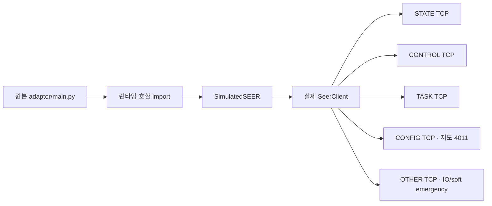

# SEER Simulator (drop-in)

`seer_simulator`는 실제 장비 없이 SEER Robokit 통신을 시험하는 전용 폴더다.
원본 `jibot-simulator`를 수정하거나 대체하지 않는다.

## 핵심 클래스

- `SimulatedSEER`: 원본 Adapter가 사용할 수 있는 SEER 시뮬레이터 클래스
- `SimulatedJIBOT`: 원본 Adapter의 기존 import 이름을 런타임에서 맞추기 위한 alias
- TCP 서버 구현: `seer_client/src/seer_client/simulator.py`

`SimulatedSEER`는 메서드만 흉내 내는 객체가 아니다. 실제 `SeerClient`가 로컬
TCP 서버 5개에 접속하므로 패킷 프레임, 요청 번호, API 번호, 포트 라우팅과 응답
처리까지 함께 시험한다.



## 가장 빠른 시험

저장소 루트에서 실행한다.

```powershell
python .\seer_client\manual_test.py `
  --simulator --x 1000 --y 2000 --theta 90 --battery 70 `
  --command "status" --command "do 3 on" --command "io" `
  --command "emergency"
```

원본 Adapter와 연결하는 스모크 테스트:

```powershell
python .\seer_client\run_adapter.py `
  --simulator --id SEER-SIM-001 `
  --x 1000 --y 2000 --theta 90 --battery 70 `
  --vehicle-smoke-test
```

WebUI는 `seer_client/run_webui.py`로 실행한다. `--fleet`에 여러 시뮬레이터를
등록하면 하나의 WebUI에서 동시에 관리할 수 있다. 각 시뮬레이터는 자기 프로세스
안에서 SEER TCP 포트 5개를 동적으로 할당하므로 서로 충돌하지 않는다. 원본 WebUI와
`adaptor/config/robots.toml`은 수정하지 않으며, 자세한 명령은
`seer_client/README.md`를 참고한다.

시뮬레이터의 로봇 상태는 메모리에서 유지된다. WebUI와 Adapter가 생성하는 설정, 상태
IPC, 지도·IO 캐시와 로그는 모두 `seer_client/runtime/` 아래에만 저장되며 운영체제
임시 폴더나 원본 `adaptor` 폴더에는 SEER 실행 파일을 만들지 않는다.

시뮬레이터는 CONFIG API 4011에 시험용 `.smap`을 응답한다. WebUI에서는 이 지도 위에
AMR 위치가 표시되며, 수동 조작 기본값은 `0.05 m/s`, `5 deg/s`다. STATE API
1012와 OTHER API 6004도 구현되어 있어 같은 `SEER SOFT E-STOP` 버튼으로 설정과
해제를 반복 시험할 수 있다. 소프트웨어 비상정지 중에는 이동 명령을 거부한다.

상단 `IO` 페이지에서 API 1013 상태를 확인하고 DO 스위치로 API 6001을 시험할 수 있다.
기본 채널 범위는 사진과 같은 DI0~DI23(24개), DO0~DO15(16개)다.

기본 시험 지도에는 `SIM_START`에서 `SIM_GOAL`로 가는 두 경로가 있다.

- `SIM_START → SIM_UPPER → SIM_GOAL`
- `SIM_START → SIM_LOWER → SIM_GOAL`

WebUI 지도에서 `SIM_GOAL`을 누르면 두 경로와 이동거리가 표시되고, 선택한 경로가
노란색으로 강조된다. 실행한 경로는 시뮬레이터가 목적지 도착·실패·취소를 반환할 때까지
1초 자동 갱신과 페이지 재진입 중에도 계속 노란색이며, 작업 종료 후 자동으로 사라진다.
고정 경로를 고르면 전체 경유점이 API 3066 한 번으로 전달되며,
중간 경유점마다 API 3051을 다시 보내지 않는다. 고정 경로가 있더라도 같은 창에서
Free Nav(API 3051 `freeGo`)를 선택할 수 있다. AMR이 이름 있는 포인트 밖에 있거나
연결 경로가 없거나 거리가 0m이면 Free Nav가 기본 선택된다. 지도 위 `화살표`
슬라이더는 AMR 마커 크기를 35~150%로 바꾸며, 선택값은 AMR·맵별로 브라우저에 저장되어
화면이나 브라우저를 다시 열어도 유지된다.

## 시뮬레이터 제한

- DI 0~23은 기본적으로 `false`다.
- DO 0~15는 메모리 상태만 변경한다.
- 충돌 회피, 안전 PLC, 실제 가감속과 장비 인터록은 재현하지 않는다.
- physical/driver emergency는 실제 안전회로가 아니며 software emergency 상태 전이만
  기능 시험한다.
- 이동은 상태 전이를 확인하기 위한 단순 보간 모델이다.
- 실제 장비의 IO 번호, 맵, 랜드마크와 모터 이름은 현장 설정을 확인해야 한다.


## 실물 전 단계에서 추가할 권장 시뮬레이션

9월 통합 시험 전에는 다음 오류 주입 시나리오를 우선 추가하는 것이 좋다.

- 정상 응답 타입 + 비정상 `ret_code`, 응답 지연, 타임아웃, 연결 끊김/재연결
- 위치 상태 정지(stale), 미로컬라이즈, 장애물/blocked, 저전압, 충전 중 상태
- 존재하지 않는 지도/랜드마크, 제어권 잠금, 비상정지 및 작업 중 취소
- 실물 수신 프레임 기록 후 시뮬레이터에서 재생하는 record/replay

현재 시뮬레이터는 요청 헤더 버전 1과 2를 모두 해석하지만 응답은 기본 버전 1로 생성한다.
RBK 3.5 장비 검증이 필요하면 응답 헤더 버전도 요청과 동일하게 반환하도록 확장한다.

## VDA5050 FMS 동일 입력

Simulator 자체가 별도의 전용 FMS JSON을 받는 구조가 아닙니다. `seer_client`의 WebUI와
`manual_test.py --vda5050`, 그리고 실제 FMS가 모두 동일한 MQTT topic인
`amr/v3/<serial>/order` 또는 `amr/v3/<serial>/instantActions`에 VDA5050 JSON을 발행합니다.
기존 Adapter가 그 JSON을 동일한 order/action parser로 처리한 뒤 실물 SEER 또는 Simulator에
SEER TCP 명령을 보냅니다.

`/order`는 `headerId`, `orderId`, `orderUpdateId`, `nodes[]`, `edges[]`를 사용하며,
node/edge Action도 각 `actions[]` 안에 `actionId`, `actionType`, `blockingType`,
`actionParameters[]` 형태로 그대로 전달됩니다. 즉시 Action은 VDA5050
`instantActions.actions[]`를 사용합니다.

Simulator에서 order node에 `nodePosition`이 있으면 기존 Adapter가 southbound에서
`goto_node_position(nodeId, x, y, theta)`를 호출하므로, 실제 FMS JSON을 그대로 흘려보낸
주행 경로를 simulator에서도 검증할 수 있습니다.
